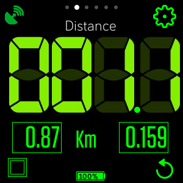

# Cockpit APP for Fitbit

With Cockpit application you can turns your Versa into a speedometer, odometer and digital compass with altimeter. 
It also shows weather information according to the current location. You can get travel statistics such a average speed, maximum speed, elapsed time and maximum altitude. You can get up 2 partial distances measurements. 
It is an ideal tool to use when it is required to monitor values such as speed, distance traveled or simply use as a compass while traveling. Even if you are not doing a specific sport activity.
It can be used as a backup navigation tool while riding a bike, running or hiking for example.
This app requires the companion GPS and internet access to update the weather information (openweathermap.org free suscription is required).
Support Metric and Imperial system of measurement.

[Cockpit App - Fitbit Link](https://gallery.fitbit.com/details/7bdad603-63fa-4cb1-924c-8035e23bb368)

# Help

## COMMON BUTTONS and ICONS:

All screens has 3 common buttons and one icon:  

>  

> Icon Connection, represents the comunication between Versa and Companion GPS.
STATUS GREEN represents OK and RED is not communication with GPS.  

> Access Configuration Screen.  

> Update weather information with Current Location.  

> Toggle screen Auto OFF ON / OFF.  

> Restart statistics counters.  

## MAIN SCREENS

1. SPEED  

 

2. DISTANCE

3. COMPASS

4. ORIENTATION

5. STATISTICS

6. WEATHER

## CONFIGURATION SCREEN

