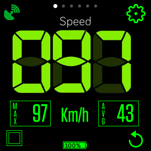
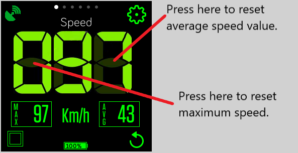
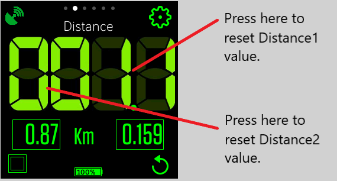
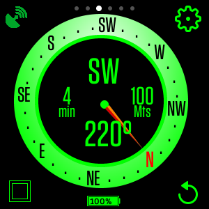
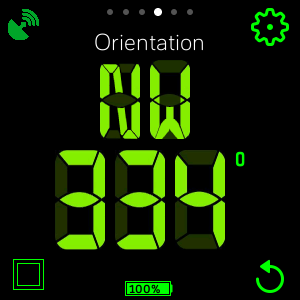
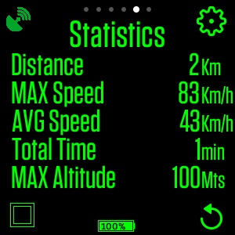
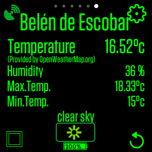
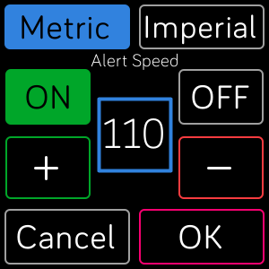
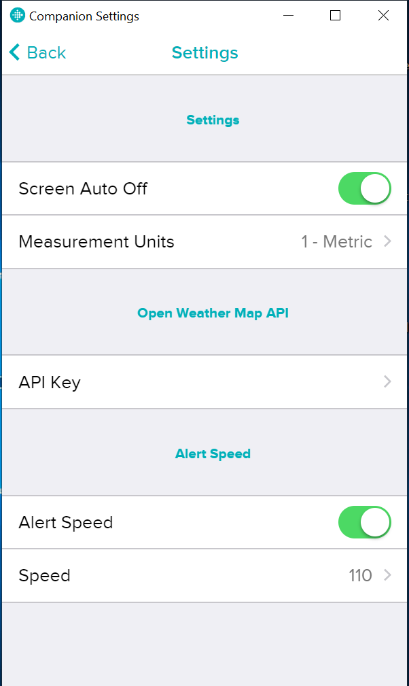

#  Cockpit APP for Fitbit  

With Cockpit application you can turns your Versa into a speedometer, odometer and digital compass with altimeter. 
It also shows weather information according to the current location. You can get travel statistics such a average speed, maximum speed, elapsed time and maximum altitude. You can get up 2 partial distances measurements. 
It is an ideal tool to use when it is required to monitor values such as speed, distance traveled or simply use as a compass while traveling. Even if you are not doing a specific sport activity.
It can be used as a backup navigation tool while riding a bike, running or hiking for example.
This app requires the companion GPS and internet access to update the weather information (openweathermap.org free suscription is required).
Support Metric and Imperial system of measurement.

  

>[Cockpit App - Fitbit Link](https://gallery.fitbit.com/details/7bdad603-63fa-4cb1-924c-8035e23bb368)

# TUTORIAL

## COMMON BUTTONS and ICONS:

All screens has 3 common buttons and one icon:  

>  

>  Icon Connection, represents the comunication between Versa and Companion GPS.
STATUS GREEN represents OK and RED is not communication with GPS.  

>  Access Configuration Screen.  

>  Toggle screen Auto OFF ON / OFF.  

>  Restart statistics counters.  

>  Update weather information with Current Location (only visible in weather screen).  

>  Shows current battery charge level.

## MAIN SCREENS

1. SPEED  

 >  
You can RESET values for AVERAGE SPEED and MAX SPEED by pressing the left part of the screen (over the first number) for max speed and right (over the last number) for average speed. 
 

2. DISTANCE

>  
You can RESET values for partial DISTANCE1 and partial DISTANCE2 by pressing the left part of the screen (over the first number) for max speed and right (over the last number) for average speed. Partial distance1 has 2 decimals and growth up to 99,99 km. Partial Distance2 has 3 decimals and growth up to 9,999 km. 

3. COMPASS

>  
Show total time, altitude and cardinal points with degress (these values are calculated according to the current movement).  

4. ORIENTATION

>  
Show cardinal point and degress (these values are calculated according to the current movement).

5. STATISTICS

>  
Show statistics information about the trip: Distance, Speed, Time and Altitude.

6. WEATHER

>  
Show weather information of current location (GPS location). The city name is obtained from this location. You can update this information using tue update button at the bottom .
Information obtained from [openweathermap.org](https://openweathermap.org/).

## CONFIGURATION SCREEN

>  
In this screen you can configure the measurement units: Metric or Imperial and activate **_SPEED ALERT_**. When speed alert is activated, Versa will vibrate and speed numbers will change from green to RED color. 

## COMPANION CONFIGURATION SCREEN (at Fitbit mobile app)

>  
You can get this configuration screen at _FitBit mobile app, Versa -> My Apps -> Cockpit -> Settings Button_.  
Here you can configure Screen Auto OFF (yes or not), Measurement Units (Metric or Imperial), Open Weather Map API KEY and Speed Alert.  

### Openweathermap.org API KEY  
>API KEY is neccesary to get weather information from your current location. Cockpit has a default API KEY that can take up to 60 queries per hour. If this number is exceeded, the query will fail.
Because of that, is recomended to obtain your own FREE API KEY from openweathermap.org.
In this configuration screen you can paste your API KEY obtained from [https://openweathermap.org/appid](https://openweathermap.org/appid). You can sign in free to get your own API KEY and use it with Cockpit.

>Luis Zurutuza. lzurutuza@gmail.com. 2019. [PayPal.Me/lzurutuza](PayPal.Me/lzurutuza)
